# **QuickServ** 

**Quick**, no-setup web **Serv**er


# About

QuickServ makes creating web applications [*dangerously*](#disclaimer) easy, no
matter what programming language you use. QuickServ:

- Has sensible defaults 
- Prints helpful error messages directly to the console
- Runs on any modern computer, with no setup or installation
- Needs no configuration
- Knows which files to run server-side, and which to serve plain
- Works with any programming language that can `read` and `write`
- Doesn't require understanding the intricacies of HTTP
- Enables Cross Origin Request Sharing (CORS) by default

QuickServ brings the heady fun of the 1990s Internet to the 2020s. It is
inspired by the [Common Gateway Interface
(CGI)](https://en.wikipedia.org/wiki/Common_Gateway_Interface), but is much
easier to set up and use. Unlike CGI, it works out of the box with no searching
for obscure log files, no learning how HTTP headers work, no fiddling with
permission bits, no worrying about CORS, no wondering where to put your scripts,
and no struggling with Apache `mod_cgi` configurations. 

<!-- I promise I'm not jaded about CGI or anything ;) -->

It is perfect for:

- Building hackathon projects without learning a web framework
- Creating internal tools
- Prototyping applications using any language
- Giving scripts web interfaces
- Controlling hardware with Raspberry Pis on your local network
- Trying out web development without being overwhelmed

[QuickServ should not be used on the open Internet.](#disclaimer) 


# Get Started

Using QuickServ is as easy as downloading the program, dragging it to your
project folder, and double clicking to run. It automatically detects which files
to execute, and which to serve directly to the user. 

## Windows

<details>
<summary>Click to view details</summary>

1. [Download for
   Windows](https://github.com/jstrieb/quickserv/releases/latest/download/quickserv_windows_x64.exe).

2. Make a project folder and add files to it. For example, if Python is
   installed, create a file called `test.py` in the project folder containing:

   ``` python
   #!python

   import random
   print(random.randint(0, 420))
   ```

   <div align="center">
   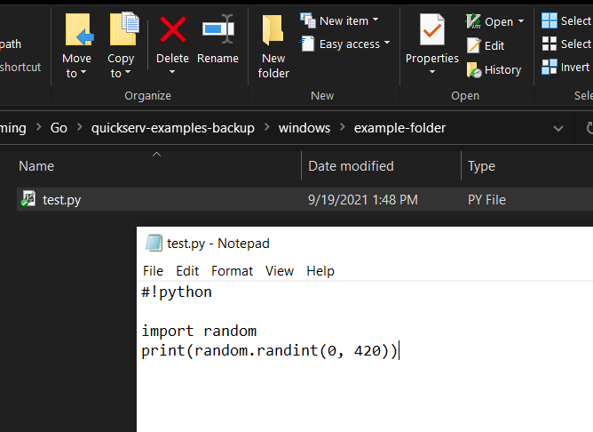
   </div>

   Since `test.py` starts with `#!something`, where `something test.py` is the
   command to execute the file, QuickServ will know to run it. If QuickServ is
   not running your file, make sure to add this to the beginning. 
   
   On Windows, QuickServ also knows to automatically run files that end in
   `.exe` and `.bat`. Any other file type needs to start with `#!something` if
   it should be run.

3. Move the downloaded `quickserv_windows_x64.exe` file to the project folder.

   <div align="center">
   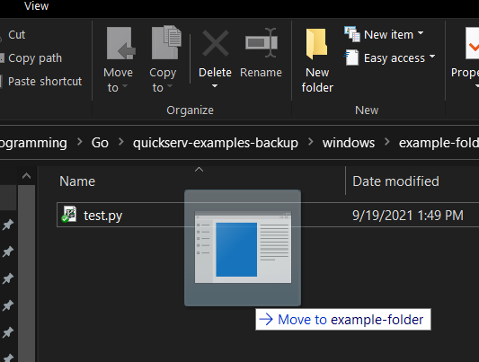
   </div>

4. Double click `quickserv_windows_x64.exe` in the project folder to start
   QuickServ. Allow access through Windows Defender if prompted.

   <div align="center">
   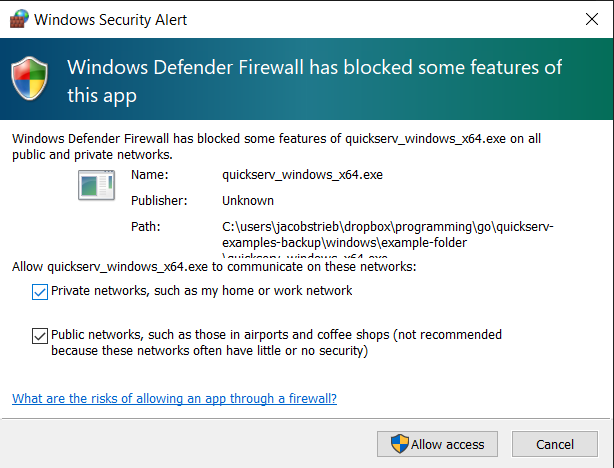<br><br>

   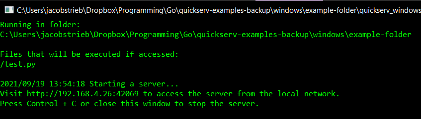
   </div>

5. Go to <http://127.0.0.1:42069> (or the address shown by QuickServ) to connect
   to your web application. In the example, to run `test.py`, go to
   <http://127.0.0.1:42069/test.py>.

   <div align="center">
   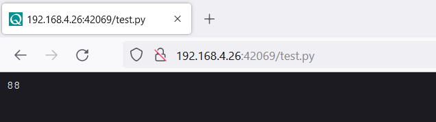
   </div>

</details>

## Mac

<details>
<summary>Click to view details</summary>

1. Download the right version for your computer. If necessary, [check what type
   of processor your Mac
   has](https://www.howtogeek.com/706226/how-to-check-if-your-mac-is-using-an-intel-or-apple-silicon-processor/).
   - [Download for
     Intel](https://github.com/jstrieb/quickserv/releases/latest/download/quickserv_macos_x64).
   - [Download for Apple
     Silicon](https://github.com/jstrieb/quickserv/releases/latest/download/quickserv_macos_arm).

2. Make a project folder and add files to it. For example, if Python is
   installed, create a file called `test.py` in the project folder containing:

   ``` python
   #!python

   import random
   print(random.randint(0, 420))
   ```

   <div align="center">
   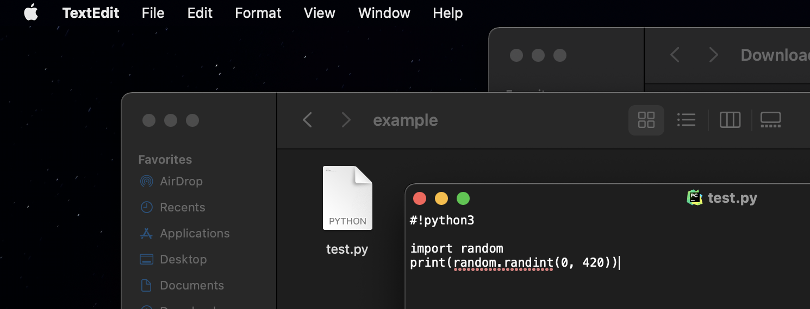
   </div>
   
   If you are making the file with TextEdit, you will need to go into `Format >
   Make Plain Text` to save the file in the correct format. 

   <div align="center">
   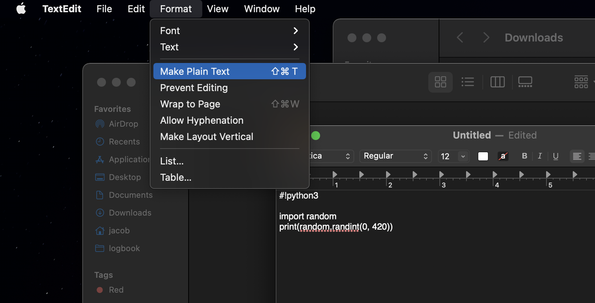
   </div>

   Since `test.py` starts with `#!something`, where `something test.py` is the
   command to execute the file, QuickServ will know to run it. If QuickServ is
   not running your file, make sure to add this to the beginning. 
   
   On Mac, QuickServ also knows to automatically run files that have been
   compiled. Any other file type needs to start with `#!something` if it should
   be run.

3. Move the downloaded `quickserv_macos_x64` or `quickserv_macos_arm` file to
   the project folder.

4. Right click `quickserv_macos_x64` or `quickserv_macos_arm` in the project
   folder and select "Open." Then, press "Open" in the confirmation dialog box. 
   After running it this way once, you will be able to start QuickServ by simply
   double-clicking the file.

   <div align="center">
   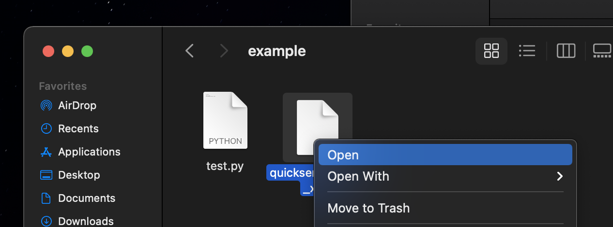<br><br>
   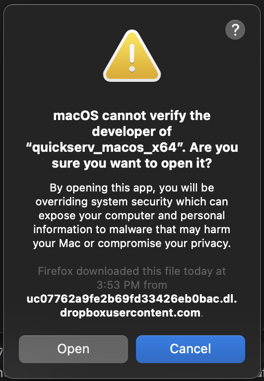<br><br>
   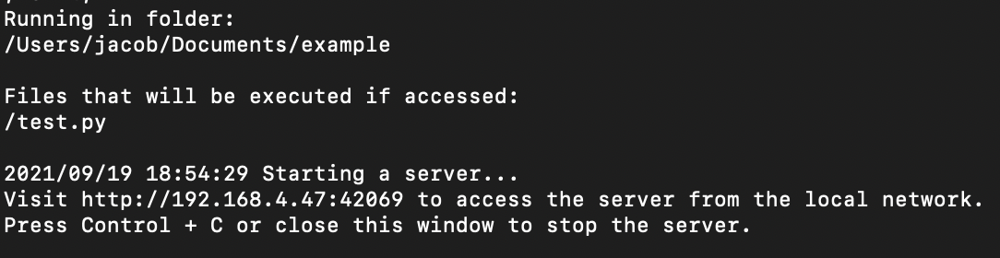
   </div>

5. Go to <http://127.0.0.1:42069> (or the address shown by QuickServ) to connect
   to your web application. In the example, to run `test.py`, go to
   <http://127.0.0.1:42069/test.py>.

   <div align="center">
   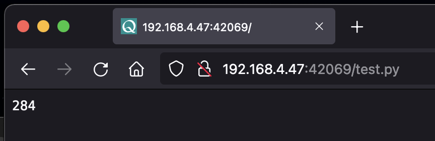
   </div>

</details>

## Raspberry Pi

<details>
<summary>Click to view details</summary>

It's easiest to install and run via the command line. [Open the
Terminal](https://projects.raspberrypi.org/en/projects/raspberry-pi-using/8).

Enter the following commands. A password may be required for the first commands. 

``` bash
# Download
sudo curl \
    --location \
    --output /usr/local/bin/quickserv \
    https://github.com/jstrieb/quickserv/releases/latest/download/quickserv_raspi_arm

# Make executable
sudo chmod +x /usr/local/bin/quickserv

# Make a project folder
mkdir -p my/project/folder

# Go to project folder
cd my/project/folder

# Add a test file 
cat <<EOF > temp.py
#!python3

import random
print(random.randint(0, 420))
EOF

# Run QuickServ
quickserv
```

Go to <http://127.0.0.1:42069> (or the address shown by QuickServ) to connect to
your web application. For example, to run `test.py`, go to
<http://127.0.0.1:42069/test.py>.

</details>

## Others

<details>
<summary>Click to view details</summary>

Clicking to run executables does not have consistent behavior across Linux
distros, so it's easiest to install and run via the command line. Depending 
on  your computer's architecture, it may be necessary to change the filename 
at the end of the `curl` HTTP request URL below.

See all download options on the [releases
page](https://github.com/jstrieb/quickserv/releases/latest).

``` bash
# Download
sudo curl \
    --location \
    --output /usr/local/bin/quickserv \
    https://github.com/jstrieb/quickserv/releases/latest/download/quickserv_linux_x64

# Make executable
sudo chmod +x /usr/local/bin/quickserv

# Make a project folder
mkdir -p /my/project/folder

# Go to project folder
cd /my/project/folder

# Add a test file 
cat <<EOF > temp.py
#!python3

import random
print(random.randint(0, 420))
EOF

# Run QuickServ
quickserv
```

Go to <http://127.0.0.1:42069> (or the address shown by QuickServ) to connect to
your web application. For example, to run `test.py`, go to
<http://127.0.0.1:42069/test.py>.

</details>


# Examples

TODO


# How It Works

All of the QuickServ code lives in
[`quickserv.go`](https://github.com/jstrieb/quickserv/blob/master/quickserv.go).
This well-commented file is less than 700 lines long, and should take an
experienced programmer with no Golang familiarity at most an hour to read.

<details>
<summary>Click to view details</summary>

QuickServ has two main parts. The first is an initialization procedure, run
exactly once at startup. The second is a handler function, called every time a
user makes an HTTP request to the server.

## Initialization Routine

When QuickServ starts up, it checks for command-line configuration flags, opens
a log file if one is passed with `--logfile` (otherwise it logs to the standard
output), and changes directories if a working directory is passed with `--dir`.
Note that the log file path is relative to the current working directory, not
relative to the one passed with `--dir`.

Next, QuickServ scans the working directory for files to run. It prints all of
the files that will be executed. This behavior is useful for determining if
QuickServ recognizes a script as executable. It also prints helpful information
for the user such as the web address to visit to access the server, and what
folder the server is running in, as well as how to stop it.

If any part of the initialization fails, an error is reported. In the event of a
fatal error, QuickServ waits for user input before quitting. This way, a user
who double-clicks the executable (as opposed to starting it from the command
line) does not have a window appear and then immediately disappear, flashing too
quickly for the error to be read.

Error messages are purposefully written with as little technical jargon as
possible, though some is unavoidable. Likely causes for the errors are also
included in error messages, so that they are easier for users to identify and
fix.

As the last step in the initialization procedure, QuickServ starts a web server
with a single handler function for all requests. The server listens on the
default port of `42069`, or on a random port if a user specified the
`--random-port` command-line flag. A random port would be desirable if the user
has to show a project built with QuickServ to someone humorless, for example.

## Request Handler

When a user visits a web page, QuickServ handles the request by calling the lone
handler function.

First, this function tries to open the file the user requested. If it cannot
find or open the file, it tries to serve a default version of the file. For
example, there is an embedded, default `favicon.ico` that gets served. If there
is no default file matching the path, it lets the built-in Go fileserver handle
the error and respond with a 404 error code.

If the file the user requested is present, it checks whether it is a directory.
If it is a directory, QuickServ looks inside for a file named `index.xxx` where
`xxx` is any file extension. If an index file is found, the index is served (and
possibly executed) as if it were the original page requested. Otherwise, the
user must have requested a directory without a default index, so QuickServ
responds with a listing of the other files in the directory.

If the file the user requested is present and not a directory (_i.e._, it is a
regular file), QuickServ checks whether or not it is executable. If so, it
executes the file it found. If not, it returns the raw file contents to the
user. In both cases, QuickServ will guess what filetype (and therefore which
`mimetype`) to use for the response.

The technique for determining if a file is executable depends on the runtime
operating system. On Windows, any file with a `.bat` or `.exe` extension is
considered executable. On non-Windows systems, any file with the executable
permission bit set is considered executable. On all systems, a file is
executable if it has a valid pseudo-shebang at the beginning. The shebang must
be on the very first line, must begin with `#!`, and must be a valid command.
For example, both of the following are acceptable, assuming `python3` is
installed and on the `PATH`:

- `#!/usr/bin/python3`
- `#!python3`

To execute a file, QuickServ either runs the file itself (if it is an `.exe` or
has the executable bit set), or it passes the file's path as the first argument
to the executable listed in its shebang. The request body is passed to the
program on standard input, and everything printed by the program on standard
output is used as the response body. Executed programs are neither responsible
for writing—nor able to write—HTTP response headers. 

Whatever the executed program prints on standard error is logged by QuickServ,
which means it gets printed in the console window by default. This is handy for
debugging. If the program terminates with a non-zero exit code, QuickServ
responds with a 500 internal server error. Otherwise it returns with a 200.

If the request is a URL-encoded POST request with form data, QuickServ
URL-decodes all of the characters except for three symbols: `%`, `&`, and `=`.
The user is responsible for substituting these. Note that it is important to
always URL-decode `%` last in the program that processes the form data.

</details>


# Disclaimer

Do not run QuickServ on the public Internet. Only run it on private networks.

QuickServ is not designed for production use. It was not created to be fast or
secure. Using QuickServ in production puts your users and yourself at risk,
please do not do it.

QuickServ lets people build dangerously insecure things. It does not sanitize
any inputs or outputs. It uses one process per request, and is susceptible to a
denial of service attack. Its security model presumes web users are trustworthy.
These characteristics make prototyping easier, but are not safe on the public
Internet.

To deter using QuickServ in production, it runs on port `42069`. Hopefully that
makes everyone think twice before entering it into a reverse proxy or port
forward config. For a more professional demo, the command-line flag
`--random-port` will instead use a random port, determined at runtime.

QuickServ is similar to the ancient CGI protocol. There are many
well-articulated, well-established [reasons that CGI is bad in
production](https://www.embedthis.com/blog/posts/stop-using-cgi/stop-using-cgi.html),
and they all apply to QuickServ in production.


# Advanced

QuickServ has advanced options configured via command line flags. These
change how and where QuickServ runs, as well as where it saves its output.

```
Usage: 
quickserv [options]

Options:
  --dir string
        Folder to serve files from. (default ".")
  --logfile string
        Log file path. Stdout if unspecified. (default "-")
  --no-pause
        Don't pause before exiting after fatal error.
  --random-port
        Use a random port instead of 42069.
```


<!--
# Motivation & Philosophy

The idea came from spending way too much time getting set up during a hackathon
with friends in college.

I started this project in C, but I finished it in Golang. It leans heavily on
the Go standard library. Go's easy web server integration meant that I could
spend most of my time optimizing the user experience. Thankfully, Go shoulders
much of the complexity for the end-user.

At home, I constantly use it to give my shell scripts simple web front-ends.
-->


# Project Status & Contributing

This project is actively developed and maintained. If there are no recent
commits, it means that everything is running smoothly!

Please [open an issue](https://github.com/jstrieb/quickserv/issues/new) with any
bugs, suggestions, or questions. This especially includes discussions about how
to make error messages as clear as possible, and how to make the default
settings applicable to as many users as possible.

Pull requests without prior discussion will be ignored – don't waste time
writing code before confirming that it will be merged in. As a busy, lone
developer, it is easier to be responsive when all code contributions have
context.


# Support the Project

There are a few ways to support the project:

- Star the repository and follow me on GitHub
- Share and upvote on sites like Twitter, Reddit, and Hacker News
- Report any bugs, glitches, or errors that you find

These things motivate me to to keep sharing what I build, and they provide
validation that my work is appreciated! They also help me improve the project.
Thanks in advance!

If you are insistent on spending money to show your support, I encourage you to
instead make a generous donation to one of the following organizations. By
advocating for Internet freedoms, organizations like these help me to feel
comfortable releasing work publicly on the Web.

- [Electronic Frontier Foundation](https://supporters.eff.org/donate/)
- [Signal Foundation](https://signal.org/donate/)
- [Mozilla](https://donate.mozilla.org/en-US/)
- [The Internet Archive](https://archive.org/donate/index.php)


# Acknowledgments

This project would not be possible without the help of:

- [Logan Snow](https://github.com/lsnow99)
- [Amy Liu](https://www.linkedin.com/in/amyjl/)
- Everyone who [supports the project](#support-the-project)
